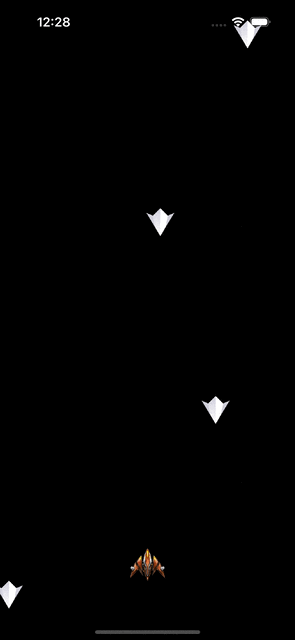

<h2 align="center">
    Space shooter using Flame Engine 🔥
</h2>

<p align="center">
  A classic Space Shooter is a vertical scrolling game where you need to shoot to eliminate as many enemies as possible.
</p>

<p align="center">
  
  <a href="https://github.com/marismarcosta">
    
  </a>
  <a href="https://www.linkedin.com/in/marismarcosta/">
    
  </a>
</p>

<p align="center">
    
</p>

## Requirements

- Flutter v3.13.0

## Run

```
flutter pub get
flutter run
```
